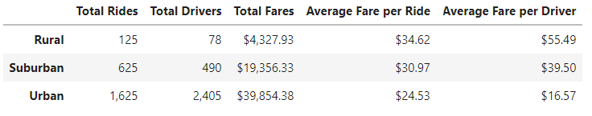
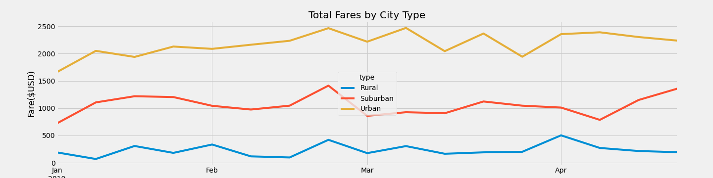
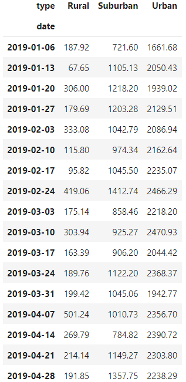

# PyBer_Analysis
## Overview of Analysis
Using the Python dependencies Pandas and MatPlotLib, an analysis of data from a ride-sharing service called PyBer. The purpose of the analysis is to compare and contrast the different metrics and statistics for each city type: urban, suburban, and rural. The analysis will include a summary dataframe of the ride-sharing data that will display the totals for riders, drivers, fares and averages of the fare per ride and per driver. A visualization will also be provided to show the total fares for each city type across four months of the year. 
## Results
 

Table 1. PyBer ride-sharing data summary.  

Table 1 shows the summary of key statistics in a dataframe for the PyBer ride-sharing data. From this dataframe summary, we can draw the following conclusions:
* Urban cities get the most rides with 1,625 and have the most drivers with 2,405 followed by suburban and then rural cities. 
* The total fares are highest in urban cities with $39,854.38, since they have the most total rides. 
* The average fare per ride is highest in rural areas with $34.62 per ride, and lowest in urban areas since rural areas with $24.53 per ride.
* The average fare per driver is highest in rural areas with $55.49 per driver and lowest in urban areas with $16.57 per driver.   

 

Figure 1. Total fares by city type.  

 

Figure 2. Dataframe containing data used to make line chart in figure 1.  

Figure 1 and its respective dataframe in figure 2 shows the total fares by city type for each week from January 1st, 2019 to April 29th, 2019.From this chart, we can draw the following conclusions:
* During the four month span, total fares for urban cities are highest each week, suburban cities are the second highest each week, and rural cities are lowest.
* Total weekly fares fluctuate similarly for each city type.
* Total fares is highest during the following weeks in 2019 for each city type:
    * Urban: March 10th: $2,470.93
    * Suburban: February 24th: $1,412.74
    * Rural: April 7th: $501.24
* Total fares is lowest during the following weeks in 2019 for each city type:
    * Urban: January 6th: $1,661.68
    * Suburban: January 6th: $721.60
    * Rural: January 13th: $67.65  

## Summary
* Three business recommendations to address the disparities among city types:
    1. Since rural cities have the lowest total fares consistently and also least amount of rides while also having the highest average fare per ride, decreasing the average fare price for rural areas may attract more riders. Doing the same for suburban areas may also help reduce disparity between city types.
    2. Urban cities have more total drivers than total rides, whereas suburban and rural cities have less total drivers than total rides. Increasing the amount of drivers in rural and suburban areas may reduce the disparity between city types. 
    3. Increase marketing funding in rural and suburban areas for the ride-sharing service. 